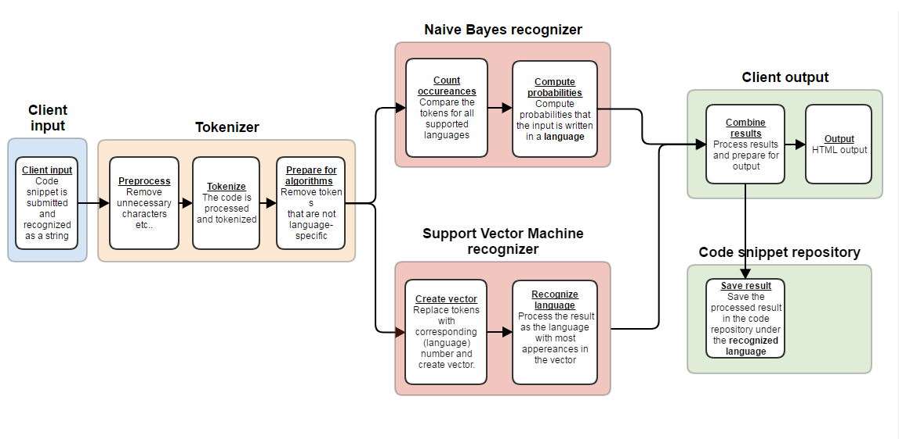

# Snippets

The goal of this project is to create an application which can recognize programming language and other useful information for code snippets using some Machine Learning techniques and algorithms. The application is able to learn and to improve the accuracy in recognizing the code snippets while processing them. Then, the application can manage the snippets repository and use it for various integrations. 

# Machine Learning

The recognition of programming language in the application is done with two different ML algorithms: Support Vector Machine and Naive Bayes. The Machine Learning Pipeline and the flow of the application is presented in the picture below.

## Support Vector Machine (SVM)

Suuporot Vector Machine algorithm for recognizing programming language for a inserted code snippet.

## Naive Bayes

Naive Bayes algorithm for recognizing programming language for a inserted code snippet.
